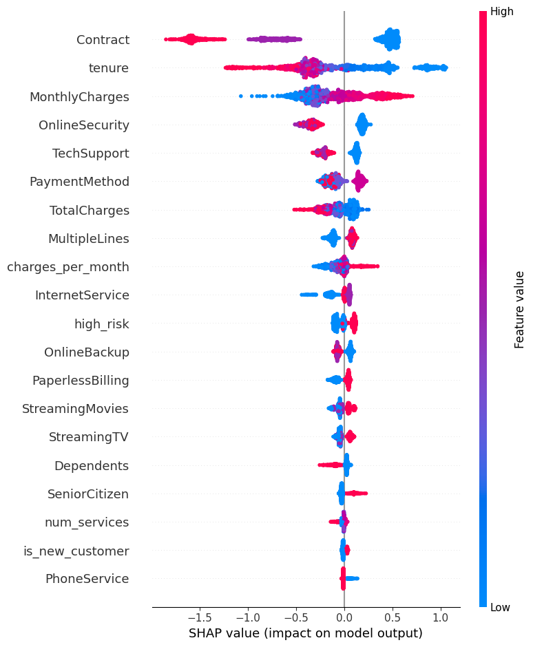

# Churn Prediction Pipeline

End-to-end ML pipeline to predict customer churn using the IBM Telco dataset.

## Results

| Model | AUC | F1 |
|---|---|---|
| Dummy Baseline | 0.50 | 0.00 |
| XGBoost Default | 0.81 | 0.55 |
| XGBoost + Optuna | **0.85** | **0.56** |

## Business Impact

A telecom company with 100,000 customers and a 26% churn rate loses ~26,000 customers every month.

With this model (AUC 0.85):
- If we identify 70% of churners before they leave
- And retention campaigns save 30% of those flagged customers
- That's **~5,400 customers saved per month**

At an average revenue of $65/month per customer, that's **~$350,000 in monthly revenue protected**.

This is why churn prediction is one of the most ROI-positive ML applications in industry.

## Project Structure

```
tabular-ml-pipeline/
├── src/
│   ├── ingest.py        # Data loading and validation
│   ├── features.py      # Feature engineering
│   ├── train.py         # Model training and evaluation
│   ├── tune.py          # Optuna hyperparameter tuning
│   ├── evaluate.py      # MLflow experiment tracking
│   └── shap_explain.py  # SHAP explainability
├── api/
│   └── main.py          # FastAPI serving
├── notebooks/
│   └── eda.ipynb        # Exploratory data analysis
├── reports/             # SHAP charts
├── Dockerfile
└── requirements.txt
```

## Tech Stack

- **Modeling:** XGBoost, scikit-learn
- **Tuning:** Optuna (50 trials, 5-fold CV)
- **Explainability:** SHAP
- **Experiment Tracking:** MLflow
- **Serving:** FastAPI + Uvicorn
- **Containerization:** Docker

## Key Features

- Stratified train/test split to handle class imbalance
- 5 engineered features on top of 20 raw columns
- Optuna hyperparameter search across 50 trials
- SHAP explanations per prediction — not just a probability
- REST API returns churn probability + top reason

## Run Locally

```bash
pip install -r requirements.txt
uvicorn api.main:app --reload
```

Then open http://127.0.0.1:8000/docs to test the API.

## Run with Docker

```bash
docker build -t churn-api .
docker run -p 8000:8000 churn-api
```

## SHAP Explainability



The model explains every prediction — not just a black box probability.

